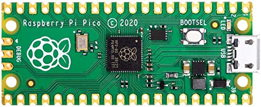

# Setup for Micropython on the Pico

Microcontrollers a miniature computers for use with electronics.  We will be programming the [Raspberry Pi Pico](https://www.raspberrypi.com/products/raspberry-pi-pico/) with the [Micropython](https://micropython.org/) language, which is an implementation of [Python 3](https://www.python.org/) for microcontrollers.  This is a powerful language in its own right, but skills developed in Python will be applicable to programming in [Java](https://en.wikipedia.org/wiki/Java_(programming_language)), [C](https://en.wikipedia.org/wiki/C_(programming_language)), or other languages.

You will need a Pico, a micro USB cable, and a laptop. Install the [Thonny](https://thonny.org/) program on your laptop.  Thonny will be used to write programs and to load them onto your Pico.

