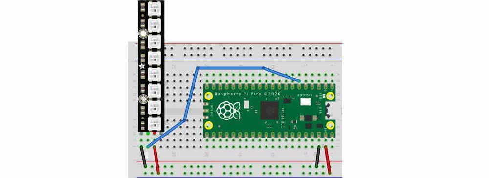

# PixelStrip in MicroPython

PixelStrip is a [MicroPython](https://micropython.org/) module for controlling WS2812 RGB LEDs on the [Raspberry Pi Pico](https://www.raspberrypi.org/products/raspberry-pi-pico/).  These LEDs are also known as  [NeoPixels](https://learn.adafruit.com/adafruit-neopixel-uberguide). The PixelStrip library allows you to add Animations to the strip.  Multiple strips can have separate animations that run in parallel.

Wire up your Neopixels (WS2812B LEDs) to power, ground, and digital input. In the following example we will use GP4 for digital input.



Copy the `npxl.py`, `pixelstrip.py`, and `colors.py` files into your Pico, and then create the following in a file named `main.py`:

```python
from utime import sleep
from pixelstrip import PixelStrip

strip = PixelStrip(4, 8, auto_write=True)

while True:
    strip[0] = (128, 0, 0, 0)
    sleep(0.5)
    strip[0] = (0, 0, 0, 0)
    sleep(0.5)
```

## Example with a loop

## Example with a timeout

